# 服务器改动 · 漫画志（Server Manga Log）

<p align="center">
  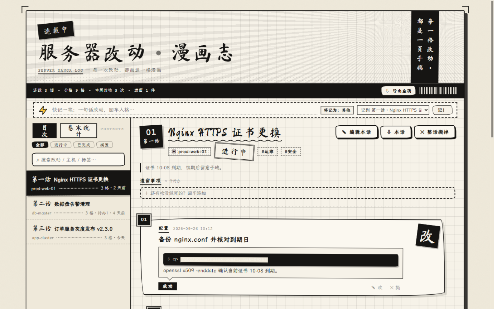
</p>

> **生化环材的同学做实验，要手写实验记录：**
> 日期、页码、现象、数据、导师签字，一样不能少。
>
> 而我们计算机的"实验"跑在服务器上——
> 改了哪行配置、重启了哪个服务、当时为什么这么改，
> 三天之后只剩一句：「我记得我改过啊？」
>
> **把服务器当实验室，把每一次改动画成漫画。**
> 一件事 = 一「话」，一次改动 = 一「格」：
> 时间、类型印章、结果徽章、命令、路径、截图、数据表，
> 全部画进黑白漫画的方格里——谁改的、为什么改、怎么验证的，一目了然。
>
> 实验记录别人手写，你的记录——**画出来**。

一款**纯本地、零依赖**的改动记录工具：黑白漫画风 + 手稿线条，
一个 Node 就能跑（连数据库都不用），数据永远只落在你自己的磁盘上。

## 多部漫画书架

一份漫画志现在可以管理多部漫画，适合把不同项目或服务的改动分开记录。

### 新建漫画

点页面上方「＋ 新漫画」并填写名称，即可新建空白漫画；创建后会自动切换过去。

<p align="center">
  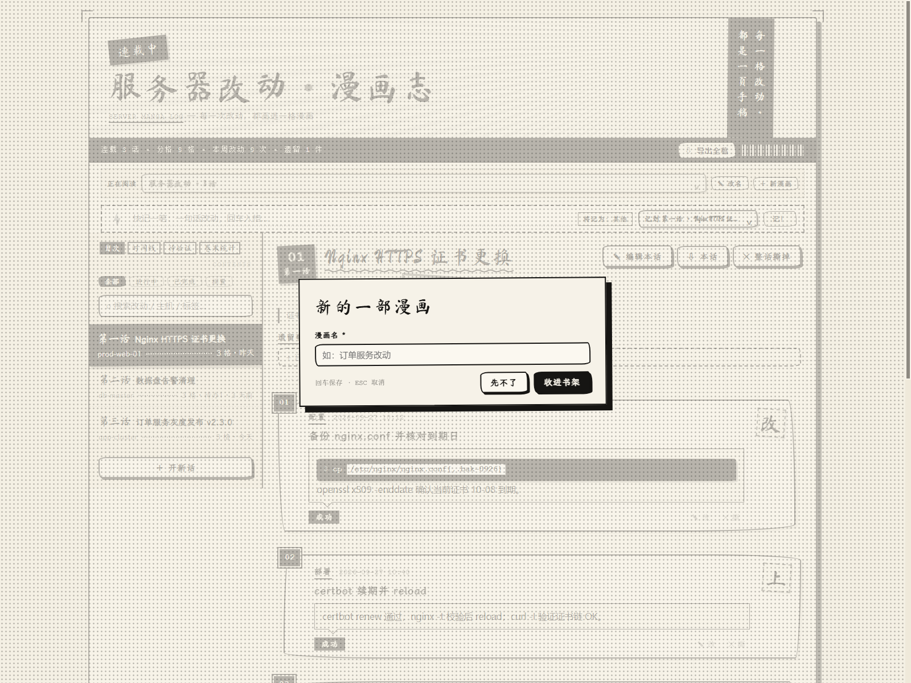
</p>

### 切换或改名

通过「正在阅读」下拉框切换漫画；点「✎ 改名」可修改当前漫画名称。升级时，旧版章节会自动归入「服务器改动」，不会丢失。

<p align="center">
  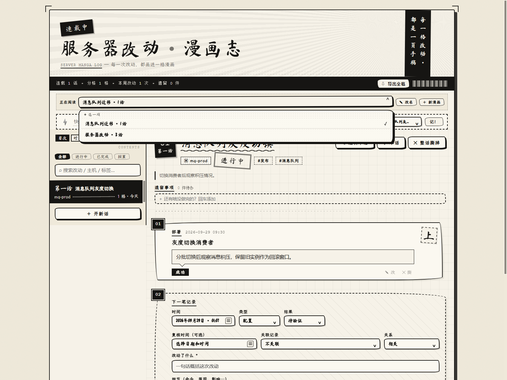
</p>
<p align="center">
  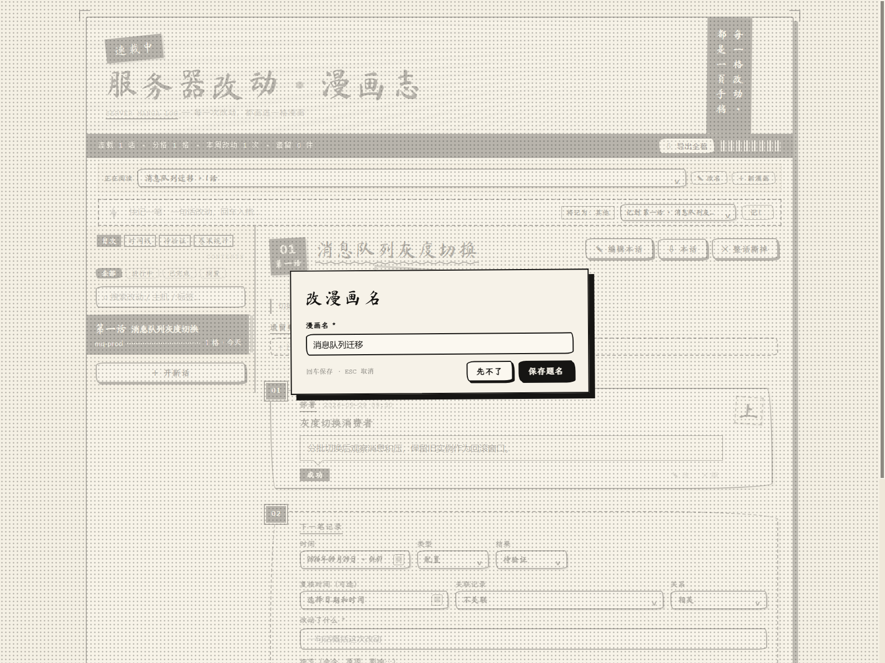
</p>

### 各自记录与统计

每部漫画分别保存自己的章节、分格和待办；时间线与待验证收件箱汇总当前漫画的所有章节，卷末统计也按当前漫画计算。

<p align="center">
  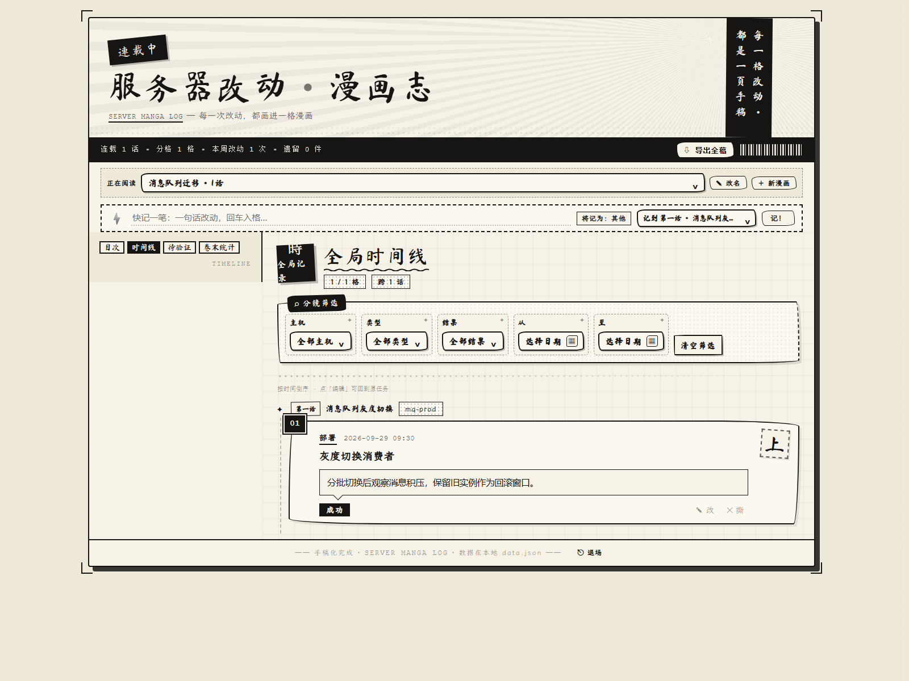
</p>
<p align="center">
  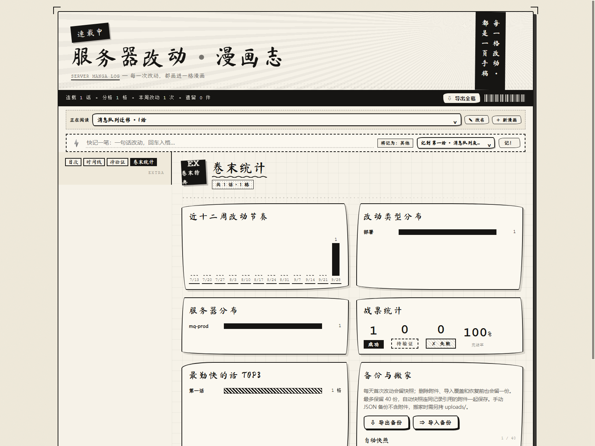
</p>

### 导出与恢复整个书架

「⇩ 导出全稿」和 JSON「导出备份」会包含整个书架；导入包含 mangas 字段的备份会整体恢复书架。

<p align="center">
  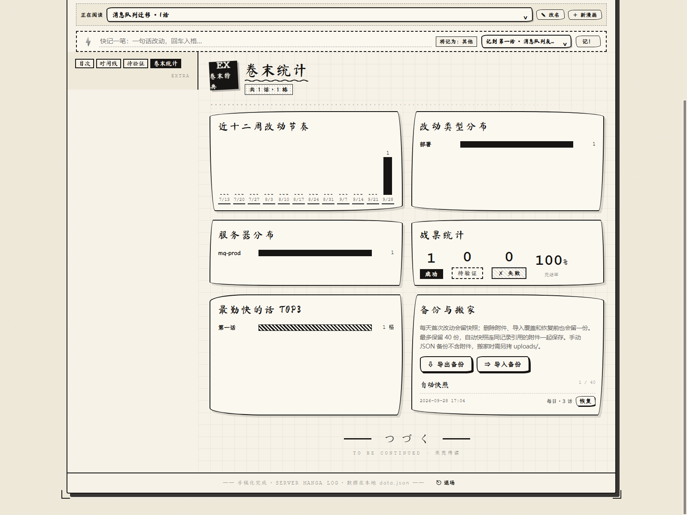
</p>

---
## 📖 目次

- [分格：一次改动，一格漫画](#分格一次改动一格漫画)
- [多部漫画书架](#多部漫画书架)
- [细节自动排版：路径・文件名・命令・链接](#细节自动排版路径文件名命令链接)
- [附件：贴图 + 文档 + 在线预览](#附件贴图--文档--在线预览)
- [快记一笔 & 遗留事项](#快记一笔--遗留事项)
- [全局时间线与待验证收件箱](#全局时间线与待验证收件箱)
- [流程模板与记录关联](#流程模板与记录关联)
- [卷末统计](#卷末统计)
- [表格编辑器](#表格编辑器)
- [口令锁：内网免登录，公网设防](#口令锁内网免登录公网设防)
- [快速开始](#快速开始)
- [部署到服务器 · 外网访问](#部署到服务器--外网访问)
- [数据与备份](#数据与备份)

## 分格：一次改动，一格漫画

<p align="center">
  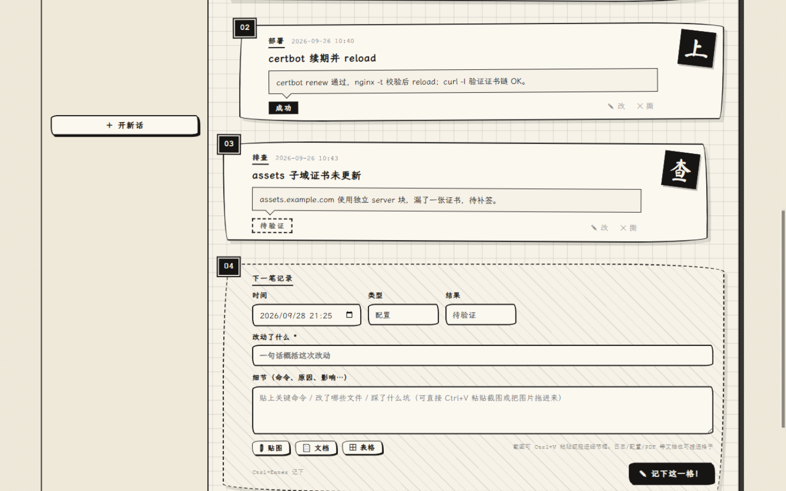
</p>

每一格自带编号、时间戳和一枚**类型印章**：配置「改」、代码「码」、部署「上」、修复「修」、排查「查」、回滚「撤」。
结果用徽章标注——实心「成功」、虚线「待验证」、斜纹「✗ 失败」，翻一眼就知道这话进展到哪。
整话结束还有一枚「つづく」：**未完待续，下一格由你来画。**

## 细节自动排版：路径・文件名・命令・链接

写细节的时候不用管格式，随手贴——渲染时自动区分：

| 你写的 | 它变成 |
|---|---|
| `/data2/lee/outputs/best.pth` 的父目录、`~/conf` | <code>路径</code>：等宽 + 底纹 + 实线下划 |
| `nginx.conf`、`best.pth`、`train.py` | <code>文件名</code>：等宽 + 虚线下划 |
| `$ git push origin main`、纯命令行、``` 围栏块 | <code>命令</code>：反白黑块 + `$` 提示符 |
| `http://...` | <code>链接</code>：波浪下划，点击直达 |

## 附件：贴图 + 文档 + 在线预览

<p align="center">
  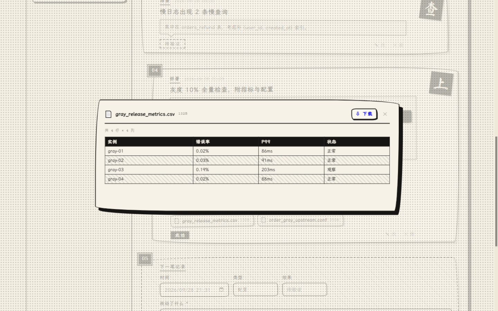
</p>

- **📎 贴图**：选图、**Ctrl+V 直接粘贴截图**、或把图片拖进细节框；点缩略图灯箱放大
- **📄 文档**：日志、配置、脚本、PDF、压缩包（单件 50MB）都能挂进格子

<p align="center">
  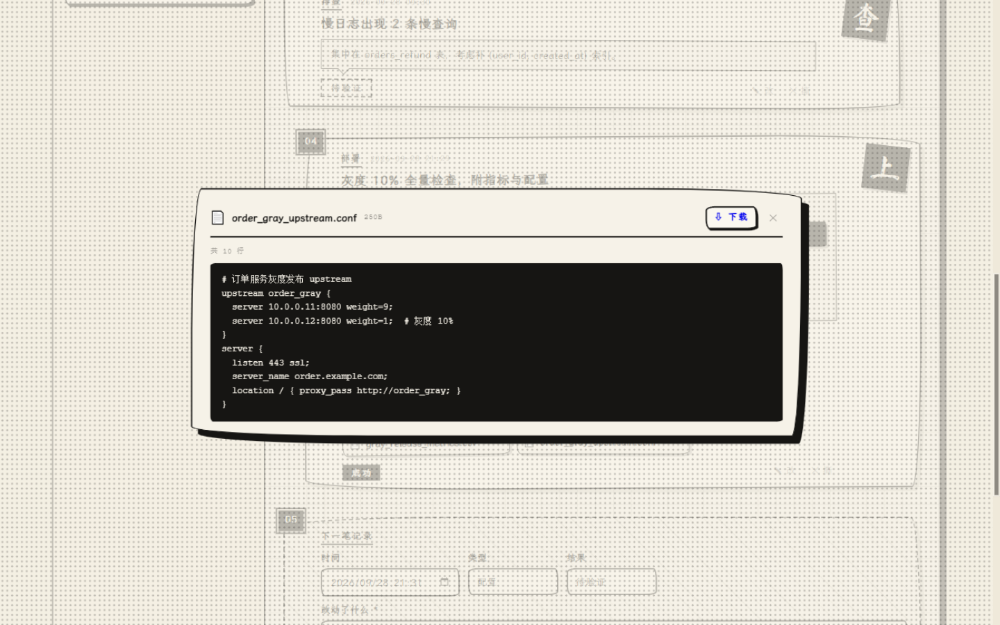
</p>

- 点文件卡片**在线预览**：CSV/TSV 自动转表格、文本/YAML/代码黑底码块、PDF 内嵌翻页
- 两份逐例 metrics（或 summary）可以**生成配对汇总表**：按病例自动配对，产出 均值±标准差 /
  配对差 / 改善例数——每轮实验后那半小时的算数誊表，变成点两下鼠标
- 文本与配置附件可选择另一份版本并排对照，新增行和删除行用底色标出
- 训练日志（`epoch x/y loss z` 格式）预览时自动解析出 已完成轮数 / best loss / 完成状态，可插入为表格
- 预览满意了再点「⇩ 下载」——预览不满意，连下载都省了

<p align="center">
  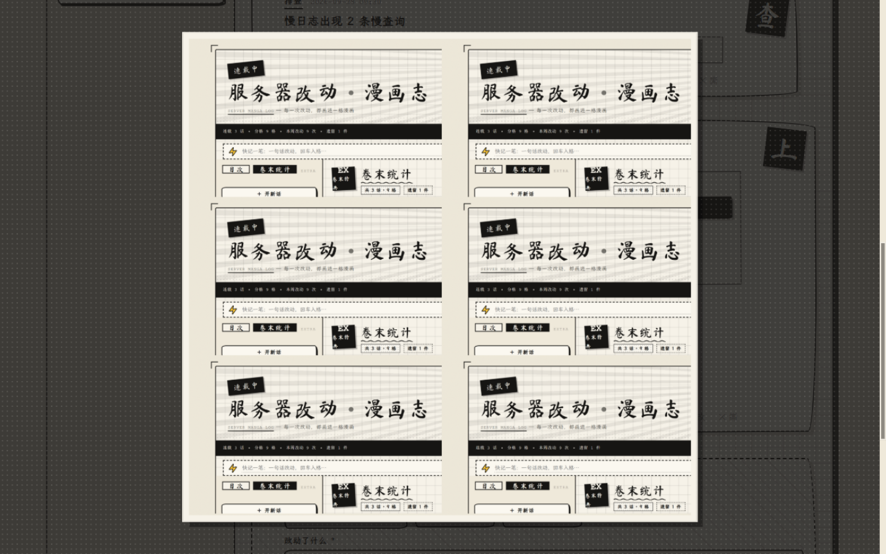
</p>

- 灯箱支持多图翻页（‹ › 按钮或 ←/→ 键），同一格里的成对重建图来回对照着看

## 快记一笔 & 遗留事项

<p align="center">
  
</p>

- 顶部⚡**快记条**：一句话回车入格，类型按关键词自动识别（`systemctl restart`→部署，`回滚`→回滚）
- 每话一份**遗留事项**：还没做完的事勾掉自动划线，数据条实时显示「遗留 N 件」——
  实验记录最怕的不是没做，是**忘了没做**

## 全局时间线与待验证收件箱

- **时间线**合并当前漫画所有话的改动，按时间倒序展示，可按主机、类型、结果与日期筛选
- **待验证**集中列出当前漫画待确认的格子和未完成事项；条目可设置复核时间，点「打开」直接回到原记录

## 流程模板与记录关联

- 新建任务可选版本发布、证书续期、数据库变更或故障排查模板，自动填入常用检查清单
- 每格可关联另一条记录并标注「相关 / 修复 / 回滚 / 验证」，点关联标题即可跳转

## 卷末统计

<p align="center">
  
</p>

连载几话、画了几格、近十二周的改动节奏、哪台服务器被你折腾得最狠、
配置/代码/部署各占几格、成功率多少——**卷末一页，全说清楚。**
向导师汇报、写周报、复盘事故，直接把这页拍上去。

## 表格编辑器

<p align="center">
  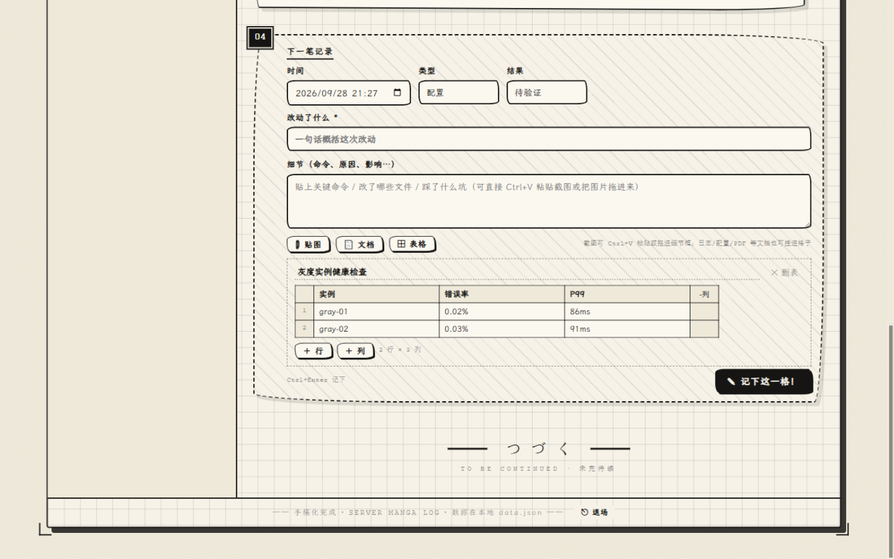
</p>

压测数据、对比结果、巡检清单——「⊞ 表格」插一张，行列自由增减，
格子里直接渲染成漫画风表格，导出 Markdown 时自动转标准表格。

## 口令锁：内网免登录，公网设防

<p align="center">
  
</p>

部署到服务器后：内网直连免口令，打开就用；走公网隧道的访客，先过「验明正身」。
错误口令限次重试，改口令即全端下线。

## 多用户：每人一份专属记录

一台服务器上多人共用时，在 `config.json` 里列出账号，即进入多用户模式：

```json
{
  "users": [
    { "name": "alice", "code": "alice 自己的口令" },
    { "name": "bob",   "code": "bob 自己的口令" }
  ]
}
```

- **登录**：打开页面填「用户名 + 口令」，会话 Cookie 用进程随机密钥签名（重启即全员重新登录）
- **完全隔离**：每个人的记录、附件、快照都落在 `users/<用户名>/` 下（`data.json` / `uploads/` /
  `.backups/`），互相看不到、也取不到对方的附件；导出备份只导出自己的
- **用户名规则**：小写字母、数字、`-`、`_`，1–32 位（会作为目录名）；口令非空即可
- **多用户模式下 `accessCode` 与内网免口令都不生效**——身份必须明确，否则隔离无从谈起
- 新增账号：改 `config.json` 后重启服务即可（新账号首次登录自动获得一份空记录）
- **自助注册**：在 `config.json` 里加 `"inviteCode": "你的邀请码"` 并重启，登录页就会出现
  「没有账号？注册一个 →」——新成员凭用户名 + 自选口令（6–64 位）+ 邀请码自行开通，
  注册即登录，数据落在自己的专属目录。不设 `inviteCode` 则注册关闭（fail-safe）；
  邀请码错了限次尝试，注册账号记录在 `users-registered.json`（不入库）
- 建议同时打开 `"secureCookie": true`（外层是 HTTPS 时）

> 单人使用保持原样即可：不配置 `users` 就是原来的单用户模式，数据仍在根目录 `data.json`。

## 快速开始

**本地**：双击 `start.bat`（或 `node server.js`），浏览器自动打开 http://127.0.0.1:4780

- 无需 `npm install`——只用 Node 内置模块；不用数据库——数据存 `data.json`
- **部署在服务器上时**，格子的附件区多一个「🖥 服务器文件」：贴一个服务器上的绝对路径
  （如 `/data2/lee/C2RV_TTT5/logs/xxx`）即可列出目录、勾选文件直接挂进格子——
  训练日志、配置、指标 JSON 不用再 scp 到本机绕一圈
  - 该功能**默认关闭**：需在 `config.json` 里配 `"fileRoots": ["/data2", "/mnt/datasets"]`
    指定允许访问的目录后才能用，白名单之外的路径一律拒绝
  - 只配真正需要的数据目录，**别配 `/` 或用户主目录**——这个接口能列出并复制进程权限内的
    任意文件，配宽了等于把 `config.json`（含口令）和 `~/.ssh` 一起交出去（已按 realpath
    解析，软链接绕不过去）
- 指定端口 `set PORT=8080`；不自动开浏览器 `set NO_OPEN=1`

## 部署到服务器 · 外网访问

应用默认只监听 `127.0.0.1`。上服务器：

```bash
scp -r ./server-manga-log user@server:/opt/server-manga-log   # 传目录
cd /opt/server-manga-log
cp config.example.json config.json && vi config.json          # ★ 设置 accessCode
sudo cp deploy/manga-log.service /etc/systemd/system/
sudo systemctl daemon-reload && sudo systemctl enable --now manga-log
```

- 内网：`http://服务器IP:4780` 直达
- 公网：没有域名/公网 IP 也能走 Cloudflare 快速隧道（`cloudflared tunnel --url http://127.0.0.1:4780`）；
  有域名推荐命名隧道固定地址；有 VPS 可用 frp
- **公网部署务必设置 `ACCESS_CODE`**：内网直连免口令，公网来源强制登录，错误口令限次重试
- **转发头信任规则**：`CF-Connecting-IP` / `X-Forwarded-For` 只在立即 TCP 对端可信时（同机 cloudflared、
  本机 nginx/frpc 连回环）才被采信；公网直连时这类头可伪造，一律忽略、按真实 socket 判定。
  反向代理部署在**另一台机器**时须显式 `"trustProxy": true`（或 `TRUST_PROXY=1`），并用防火墙限制端口只允许代理机直连
- 外层是 HTTPS 隧道/反代时建议 `"secureCookie": true`（或 `SECURE_COOKIE=1`），会话 Cookie 加 `Secure`
- `config.json` 语法错误会**拒绝启动**而不是静默回退默认值，防止 accessCode 被无声禁用

详细步骤见 [README 部署章节](#部署到服务器--外网访问) 与 `deploy/` 目录。

## 数据与备份

- 记录存 `data.json`，附件存 `uploads/`；手动迁移时复制这两个位置
- 服务每天首次写入时生成自动快照；删除附件、导入覆盖与恢复前也会先保存快照。自动快照保留引用的附件，最多 40 份，可在卷末统计页一键恢复
- JSON 损坏自动备份重建；「⇩ 导出备份 / ⇒ 导入备份」在卷末统计页
- 导出 Markdown：「⇩ 导出全稿」或「⇩ 本话」，路径/命令/表格/附件链接一并带走

## 目录结构

```
server-manga-log/
├── server.js            # 本地服务 + API + 图片/文档上传（零依赖）
├── start.bat            # Windows 双击启动
├── config.example.json  # 口令/监听配置模板
├── deploy/              # systemd 服务文件
├── docs/img/            # README 截图
├── data.json            # （运行时生成）你的全部记录
├── .backups/            # （运行时生成）滚动自动快照，最多 40 份
├── uploads/             # （运行时生成）贴图与文档
└── public/              # 页面、样式、逻辑、内置手写字体
```

## 快捷键

`N` 开新话 ｜ `/` 搜索 ｜ `Ctrl+Enter` 提交 ｜ `Esc` 关闭弹窗

---

<p align="center">
  <span style="font-size:1.4em">つづく</span><br>
  <sub>下一话，由你来记。</sub>
</p>
